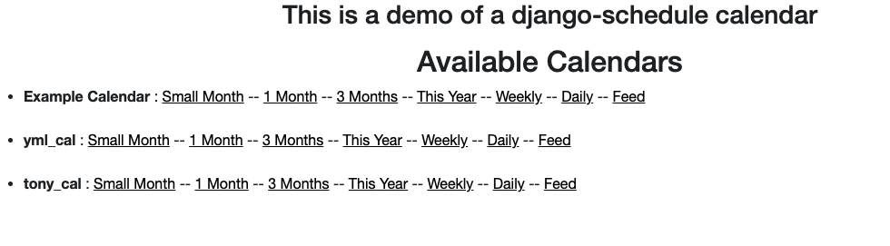

# django-scheduler-sample

This is a sample project using django-scheduler and django-scheduler-views.
From

https://github.com/llazzaro/django-scheduler-sample

I cloned the original project to evaluate and see if it is easy to use.

## Install
* Install python
* Install pip
* Install django
* Install packages

      pip install -r requirements.txt

## Setup
1 Export Django Project Settings as ENV Variable
  
      export DJANGO_SETTINGS_MODULE=project_sample.settings
### manage.py 
manage.py is used to run django project commands it was moved to root directory

2 Install bower
  
      python manage.py bower install
3 Run DB migrations
  
      python manage.py migrate
* Group static content

      python manage.py runserver

## Populate Sample Data
There are 2 custom django-admin commands 

load_example_data

    python manage.py load_example_data

    checking for existing data ...
    Sample data not found in db.
    Install it...
    Create Example Calendar ...
    The Example Calendar is created.
    Do we need to install the most common rules?
    Need to install the basic rules
    YEARLY recurrence created
    Monthly recurrence created
    Weekly recurrence created
    Daily recurrence created
    Rules installed.
    Create some events

load_sample_data

    python manage.py load_sample_data

    checking for existing data ...
    Sample data not found in db.
    Install it...
    Create 2 calendars : tony_cal, yml_cal
    First calendar is created
    Second calendar is created
    Do we need to create the most common rules?
    The common rules are installed.
    Create some events
    

## Define Urls

    http://127.0.0.1:8000
    http://127.0.0.1:8000/schedule/
    http://127.0.0.1:8000/fullcalendar/

## Images
Home Page

Schedule

Full Calendar

Daily Calendar

Weekly Calendar
